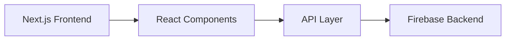

# 📚 Bookify

A full-stack book management application for browsing, organizing, and discovering books. Bookify is a modern web application built with Next.js, React, and TypeScript.


|                   |                                                        |
| ----------------- | ------------------------------------------------------ |
| 🟢 Tech           | Next.js • React • TypeScript • Tailwind CSS            |
| 📍 Local App      | `http://localhost:3000`                                |
| 🔐 Current Status | Core book browsing and discovery features implemented. |

## 📸 Preview


## 🚀 Highlights

- Modern Next.js 16 frontend with React 19
- TypeScript 5.7 for type-safe development
- Responsive design with Tailwind CSS 3.4
- Firebase integration for authentication and data storage
- React Query for efficient data fetching
- Book catalog browsing and search functionality
- Book details and discovery features

## 🧩 Problem

Book enthusiasts and collectors struggle to organize and discover books efficiently across various sources. Managing personal collections, finding recommendations, and keeping track of reading progress can be overwhelming and time-consuming.

## 💡 Solution

Bookify centralizes book discovery and management into one user-friendly platform. The application provides an intuitive interface for browsing books, organizing personal collections, and discovering new titles tailored to your interests.

## ⚙️ Features

- Book catalog with search and filtering
- Book details and metadata display
- Personal book collection management
- Book discovery and recommendations
- Responsive UI for desktop and mobile
- Firebase authentication
- Rate limiting with Upstash Redis

## 🏗 Architecture

The system follows a modern full-stack architecture:

- Next.js 16 frontend with React 19 components
- TypeScript for type safety across the application
- Tailwind CSS for responsive styling
- Firebase for authentication and data storage
- React Query for state management and data fetching
- API integration for book data



## 🛠 Tech Stack

| Tool           | Version |
| -------------- | ------- |
| Next.js        | 16.2.3  |
| React          | 19.1.0  |
| TypeScript     | 5.7.2   |
| Tailwind CSS   | 3.4.14  |
| Firebase       | 11.9.0  |
| React Query    | 5.59.0  |
| Radix UI       | 2.1.2   |
| Embla Carousel | 8.3.0   |
| Node.js        | 20+     |

## 🚀 Getting Started

### 1. Clone Repository

```bash
git clone https://github.com/matej04-dot/bookify.git
cd bookify
```

### 2. Install Dependencies

```bash
npm install
```

### 3. Run Development Server

```bash
npm run dev
```

Open your browser and navigate to:

```text
http://localhost:3000
```

## 🔐 Environment Variables

Create `.env.local` to configure Firebase and API endpoints:

```env
NEXT_PUBLIC_FIREBASE_API_KEY=your_key
NEXT_PUBLIC_FIREBASE_AUTH_DOMAIN=your_domain
NEXT_PUBLIC_FIREBASE_PROJECT_ID=your_project_id
NEXT_PUBLIC_FIREBASE_STORAGE_BUCKET=your_bucket
NEXT_PUBLIC_FIREBASE_MESSAGING_SENDER_ID=your_id
NEXT_PUBLIC_FIREBASE_APP_ID=your_app_id
UPSTASH_REDIS_URL=your_redis_url
UPSTASH_REDIS_TOKEN=your_token
```

## ✅ Quality Checks

```bash
npm install
npm run lint
npm run build
```

## 👤 Author

- Matej Kraljević
- Repository: [matej04-dot/bookify](https://github.com/matej04-dot/bookify)

## 📄 License

This project is licensed under the **MIT License**. See [LICENSE](./LICENSE) for details.
