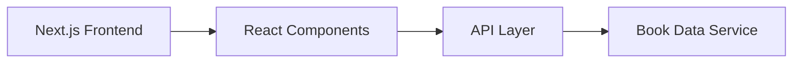

# 📚 Bookify

A full-stack book management application for browsing, organizing, and discovering books. Bookify is a modern web application built with Next.js, React, and TypeScript.


| | |
| --- | --- |
| 🟢 Tech | Next.js • React • TypeScript • Tailwind CSS |
| 📍 Local App | `http://localhost:3000` |
| 🔐 Current Status | Core book browsing and discovery features implemented. |

## 📸 Preview

> A modern, intuitive interface for book discovery and management.

## 🚀 Highlights

- Modern Next.js 15 frontend with React 19
- TypeScript for type-safe development
- Responsive design with Tailwind CSS
- Book catalog browsing and search functionality
- Book details and discovery features

## 🧩 Problem

Book enthusiasts and collectors struggle to organize and discover books efficiently across various sources. Managing personal collections, finding recommendations, and keeping track of reading progress requires a centralized solution.

## 💡 Solution

Bookify centralizes book discovery and management into one user-friendly platform. The application provides an intuitive interface for browsing books, organizing personal collections, and discovering new titles based on interests and preferences.

## ⚙️ Features

- Book catalog with search and filtering
- Book details and metadata display
- Personal book collection management
- Book discovery and recommendations
- Responsive UI for desktop and mobile

## 🏗 Architecture

The system follows a modern full-stack architecture:

- Next.js frontend with React components
- TypeScript for type safety across the application
- Tailwind CSS for responsive styling
- API integration for book data



## 🛠 Tech Stack

| Area | Stack |
| --- | --- |
| Frontend | Next.js 15, React 19, TypeScript, Tailwind CSS |
| Styling | Tailwind CSS |
| Documentation | Markdown |

## 🚀 Getting Started

### 1. Clone Repository

```bash
git clone https://github.com/matej04-dot/bookify.git
cd bookify
```

### 2. Install Dependencies

```bash
npm install
```

### 3. Run Development Server

```bash
npm run dev
```

Open:

```text
http://localhost:3000
```

## 🔐 Environment Variables

Create `.env.local` if you need to configure API endpoints or other settings:

```env
NEXT_PUBLIC_API_URL=https://your-api-endpoint.com
```

## ✅ Quality Checks

```bash
npm install
npm run type-check
npm run build
```

## 🔮 Future Improvements

- Add user authentication and accounts
- Add book ratings and reviews
- Add reading progress tracking
- Add social features for book sharing
- Add advanced filtering and sorting options
- Add automated tests
- Add CI/CD pipeline

## 👤 Author

- Matej Kraljević

- Repository: [matej04-dot/bookify](https://github.com/matej04-dot/bookify)

## 📄 License

This project is licensed under the **MIT License**. See [LICENSE](./LICENSE) for details.
